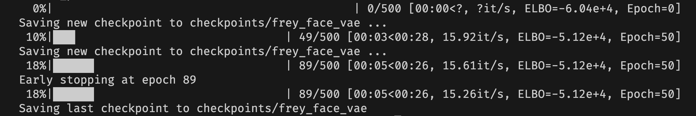
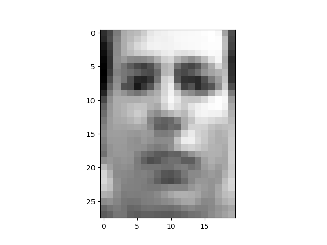

# Implement of Variation Auto Encoder
## References
[Auto-Encoding Variational Bayes](https://arxiv.org/pdf/1312.6114.pdf) \
[An Introduction to Variational Autoencoders](https://arxiv.org/pdf/1906.02691.pdf)

## Configuration
Create a python environment:
```
python3 -m venv <env-name>
```

Activate the environment:
```
source <env-name>/bin/activate
```

Install the depencies:
```
pip install -r requirements.txt
```

## Training
There a couple of pre-implemented VAE's. In order to train a model use the following CLI command:
```
python3 train.py \   
--model=<model-name> \
--config=<config-path> \
--epochs=<epochs> \
--batch_size=<batch-size> \
--patience=<patience> \
--save_path=<save-path> \
--save_period=<save-period>
```
> `<model>` the name of the model\
> `<config-path` the path to the model's configuration file\
> `<epochs>` the number of epochs\
> `<batch-size>` the batch size\
> `<patience>` the early stopping patience\
> `<save-path>` the folder where the checkpoints will be saved. If not given, they will be saved to `checkpoints/<model-name>`
> `<save-period>` how many periods to wait to save a checkpoint
### Example

Command:
```
python3 train.py \
--model="frey_face_vae" \
--config="./configs/frey_face_vae.json" \
--epochs=500 \
--batch_size=100 \
--patience=3 \
--save_period=50
```
Result:


## Generation
After training a model, you can generate new data from an input data. To do so, use the following CLI command:
```
python3 generate.py \ 
--model=<model-name> \
--config=<config-path> \
--weights_path=<weights-path> \
--input=<input-path> \
--count=<count>
```
> `<model>` the name of the model\
> `<config-path` the path to the model's configuration file\
> `<weigths-path>` the path to the model's trained weights\
> `<input-path>` the path to the input used to generate new data\
> `<count>` the number of new data to generate\

### Example
Command:
```
python3 generate.py \
--model="frey_face_vae" \
--config="./configs/frey_face_vae.json" \
--weights_path="./checkpoints/frey_face_vae/13_07_2023-09_34_48.pt" \
--input="./inputs/frey_face/face.png" \
--count=5
```

We get the folling images in `matplotlib` windows:




